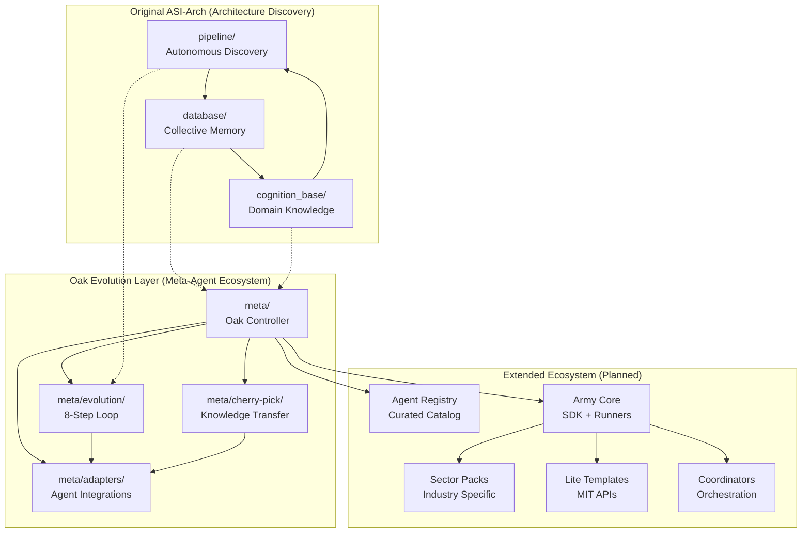

# ASI-Arch: Evolutionary AI Agent Ecosystem

<p align="center">
  <h1 align="center">🧬 AlphaGo Moment + Rich Sutton's Oak Architecture</h1>
</p>

<p align="center">
  <a href="https://github.com/adrianlerer/ASI-Arch/blob/main/LICENSE"></a>
  <a href="https://arxiv.org/pdf/2507.18074"></a>
  <a href="#"></a>
  <a href="#"></a>
</p>

## 🎯 Dual Vision: Discovery + Evolution

This repository combines two powerful approaches to artificial intelligence:

1. **🔬 Autonomous Architecture Discovery**: The original ASI-Arch system that discovered 106 novel linear attention architectures
2. **🧠 Oak Architecture Evolution**: A new meta-agent ecosystem implementing Rich Sutton's Oak Architecture principles for continuous agent improvement

### 🚀 What's New: The Oak Evolution Layer

Building on the foundation of autonomous architecture discovery, we've added a **nursery of evolutionary and improvable AI agents** that:

- **Learn from Runtime Experience**: No hardcoded domain knowledge
- **Develop Open Abstractions**: Unlimited concept development constrained only by computational resources  
- **Evolve Continuously**: 8-step Oak Architecture loop for perpetual improvement
- **Coordinate Intelligently**: Meta-agent orchestration of specialized agent teams

### Core Principles (Based on Rich Sutton's Oak Architecture)

- **🎯 Generalidad**: No domain-specific knowledge hardcoded in design
- **🔬 Experiencial**: Learning exclusively from runtime experience
- **🌐 Abstracción Abierta**: Unlimited development of concepts and thinking patterns

## 🏗️ Ecosystem Architecture

### Original ASI-Arch Components
- **🧬 Autonomous Architecture Discovery Pipeline** (`pipeline/`): Multi-agent system for architectural innovation
- **🗄️ Architecture Database** (`database/`): MongoDB-based collective memory system
- **🧠 Cognition Base** (`cognition_base/`): RAG-powered domain knowledge repository

### New Oak Evolution Layer
- **🎯 Meta-Agent Controller** (`meta/`): Oak Architecture implementation and coordination
- **🤖 Agent Adapters** (`meta/adapters/`): Integration bridges for external AI systems
- **🔄 Evolution Loop** (`meta/evolution/`): Continuous improvement algorithms
- **🍒 Cherry-Pick System** (`meta/cherry-pick/`): Cross-agent knowledge transfer

## 🌐 Extended Ecosystem Architecture



## 🔄 Evolutionary Loop

The meta-agent implements the 8-step Oak Architecture loop:

1. **Learn policies and value functions** maximizing reward
2. **Generate new state features** 
3. **Rank features** by utility
4. **Create subproblems** for highly ranked features
5. **Learn subproblem solutions**
6. **Learn transition models** for solutions
7. **Plan** using abstract models
8. **Maintain metadata** about utility

## 🚀 Quick Start

### Option 1: Original Architecture Discovery
```bash
# Setup the discovery environment
conda create -n asi-arch python=3.10
conda activate asi-arch

# Install dependencies
pip install -r requirements.txt
pip3 install torch==2.4.0 --index-url https://download.pytorch.org/whl/cu124

# Start discovery services
cd database && docker-compose up -d && ./start_api.sh
cd ../cognition_base && docker-compose up -d && python rag_api.py

# Run architecture discovery
cd ../pipeline && python pipeline.py
```

### Option 2: Oak Evolution Ecosystem (NEW!)
```bash
# Setup Node.js environment
npm install

# Initialize the complete ecosystem
npm run init

# Start evolutionary meta-agent
npm run evolve

# Monitor agent ecosystem
npm run monitor

# Sync with agent registry
npm run sync:registry
```

### Option 3: Hybrid Mode (Recommended)
```bash
# Run both systems for maximum discovery + evolution
# Terminal 1: Architecture Discovery
conda activate asi-arch && cd pipeline && python pipeline.py

# Terminal 2: Oak Evolution
npm run evolve

# Terminal 3: Monitoring
npm run monitor
```

## 📁 Repository Structure

```
asi-arch-meta/
├── .github/workflows/          # CI/CD pipelines
├── docs/                       # Documentation
├── meta/
│   ├── adapters/              # External agent adapters
│   │   └── kimi_k2_adapter.ts # Kimi K2 integration
│   ├── evolution/             # Evolutionary algorithms
│   │   └── loop.ts           # 8-step Oak loop
│   ├── cherry-pick/           # Inter-repo strategies
│   └── policies/              # Evolution policies
├── scripts/                   # Automation scripts
├── src/                       # Core TypeScript code
└── tests/                     # Test suites
```

## 🤖 Integrated Agents

### Primary Agents
- **Flow Interpreter**: Ingests and creates intermediate representations
- **Evo Debugger**: Generates and tests patches automatically
- **Explainer Teacher**: Provides pedagogical explanations
- **Reality Validator**: QA, coverage, performance, security validation
- **Production Bridge**: Packaging and deployment automation

### External Integrations
- **Kimi K2**: Advanced reasoning and knowledge integration
- **Custom Agents**: Via standardized adapter interface

## 🔧 Meta-Agent Operations

### Cherry-Picking Strategies
- **Cross-repo feature extraction**
- **Automated PR generation**
- **Conflict resolution policies**
- **Quality gate enforcement**

### Evolution Tracking
- **Fitness metrics**: robustness, reproducibility, latency, cost
- **Genealogy tracking**: parent-child relationships
- **Performance analytics**: trends and plateaus
- **Resource optimization**: compute efficiency

## 🎛️ Configuration

The meta-agent behavior is controlled through:

- `meta/policies/evolution_loop.md`: Evolution cycle parameters
- `meta/cherry-pick/strategies.md`: Inter-repo strategies
- `META_AGREEMENTS.md`: Curation and acceptance policies

## 🔄 Integration with Ecosystem

### Automatic Synchronization
- **Registry sync**: Updates agent catalog every 24h
- **Health monitoring**: Checks repo status and CI
- **Security scanning**: Dependabot integration
- **Version management**: Semantic releases

### Quality Gates
- **License compliance**: MIT/Apache-2.0 only for Lite versions
- **Security standards**: No critical CVEs
- **Test coverage**: Minimum thresholds
- **Documentation**: Complete API docs

## 🚀 Deployment

The meta-agent can be deployed in multiple modes:

- **Development**: Local evolution loop
- **Production**: Cloud-native orchestration
- **Hybrid**: Local + cloud coordination

## 📊 Monitoring & Analytics

Track ecosystem health through:
- Agent performance metrics
- Evolution success rates
- Resource utilization
- User adoption statistics

## 🤝 Contributing

See [CONTRIBUTING.md](CONTRIBUTING.md) for guidelines on:
- Adding new agents to the ecosystem
- Implementing evolutionary strategies
- Quality standards and testing
- Documentation requirements

## 📄 License

This project is licensed under the MIT License - see the [LICENSE](LICENSE) file for details.

## 🙏 Acknowledgments

- **Rich Sutton**: Oak Architecture inspiration
- **ASI-Arch Team**: Original evolutionary framework
- **Open Source Community**: Various integrated projects

---

*The future of AI is not in individual models, but in ecosystems of evolving, cooperating agents that continuously improve themselves through experience.*